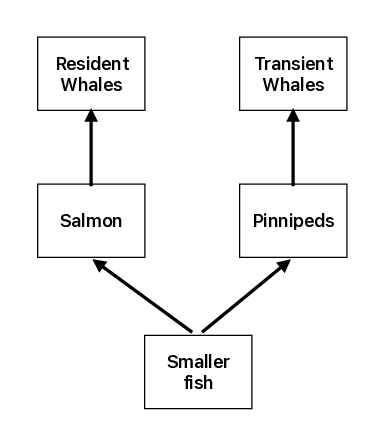

```{r setup, include=FALSE}
knitr::opts_chunk$set(echo = TRUE,tidy.opts = list(width.cutoff = 60), tidy = TRUE)
```

# Introduction
<!-- Citations (for generating bibliography): [@baird]. [@estes].  -->

We use a mathematical model to simulate the interaction between two distinct types of killer whales, transient whales and resident whales, based on Baird and other's work [@baird]. Killer whales are apex predators, therefore they could influence the whole ocean ecosystem through top-down control from the top of the oceanic trophic cascade. For example, Estes and others have analyzed the whole-sale collapse of marine mammals in the North Pacific Ocean and southern Bering Sea [@estes]; discovering that killer whales were the major factor for this collapse as they turned to otters in the region seeking alternative food source, in response to decreasing sea lions population. The killer whales' dietary shift ultimately result from human massive whale harvest after World War II. Therefore, understanding how killer whales interact with the ecosystem will help human make better decisions to preserving the ocean ecosystem, which is playing an ever-more important role in sinking carbon, countering the effect of climate change.

According to Baird and others [@baird], there are two distinct types of killer whales: resident whales and transient whales.


# Model A:
```{r}
library(deSolve)
```

Part 1: Equations 
$$
\begin{aligned}
R'=&r_RR(K_R-R-\alpha P)/K_R\\
T'=&T(BCP-D_T)\\
P'=&r_PP(K_P-P-\beta R)/K_P-CPT
\end{aligned}
$$
Parameters
```{=html}
<table>
    <colgroup>
        <col style="width:20%;">
        <col style="width:60%;">
        <col style="width:20%;">
    </colgroup>
    <tr>
        <th>Parameters</th>
        <th>Definitions</th>
        <!--<th>Value ranges</th>-->
    </tr>
    <tr>
        <td>r<sub>R</sub></td>
        <td>Intrinsic rate of increase</td>
    </tr>
    <tr>
        <td>K<sub>R</sub></td>
        <td>Carrying capacity for R</td>
    </tr>
    <tr>
        <td>r<sub>P</sub></td>
        <td>Intrinsic rate of increase</td>
    </tr>
    <tr>
        <td>K<sub>P</sub></td>
        <td>Carrying capacity for T</td>
    </tr>
    <tr>
        <td>&alpha;</td>
        <td>Competition coefficient between P and R</td>
    </tr>
    <tr>
        <td>&beta;</td>
        <td>Competition coefficient between P and R</td>
    </tr>
        <tr>
        <td>C</td>
        <td>Average number of pinnipeds captured per unit time per unit P density</td>
    </tr>
    </tr>
        <tr>
        <td>B</td>
        <td>Conversion efficiency for T to consume P</td>
    </tr>
    <tr>
        <td>D<sub>T</sub></td>
        <td>Death rate</td>
    </tr>
</table>
```
Paremeter constraints: According to Baird, the strength of damping depends on the  parameter: $\alpha\beta<1$; the smaller the value, the more intense damping is. Other constraints: $K_P\gg K_R$. $\beta\gg\alpha$. $BCK_P>D_T$.
```{r}
# Parameters
r_R <- 0.5      # resident whale growth rate
K_R <- 30       # resident carrying capacity

r_P <- 0.8      # pinniped growth rate
K_P <- 500      # pinniped carrying capacity

alpha <- 0.2    # effect of pinnipeds on residents
beta  <- 0.6    # effect of residents on pinnipeds

C   <- 0.02     # predation rate
B   <- 0.2      # conversion efficiency
D_T <- 0.1      # transient whale death rate
```

Initialization
```{r}
R0 <- 10
P0 <- 200
T0 <- 5

state_ini <- c(R = R0,
               P = P0,
               T = T0)
```

Model A equations
```{r}
modelA <- function(time, state, parameters){

  R <- state[1]
  P <- state[2]
  T <- state[3]

  # Resident whales (competition with P)
  dR <- r_R * R * (1 - (R + alpha*P)/K_R)

  # Pinnipeds (competition + predation)
  dP <- r_P * P * (1 - (P + beta*R)/K_P) -
        C * P * T

  # Transient whales (predator)
  dT <- B * C * P * T -
        D_T * T

  return(list(c(dR, dP, dT)))
}
```

Add time to this function
```{r}
time_vec <- seq(0, 200, length.out = 2000)

outA <- ode(y = state_ini,
            times = time_vec,
            func = modelA,
            parms = NULL)

outA <- as.data.frame(outA)
```

Plot
```{r}
plot(outA$time, outA$R,
     type = "l",
     col = "blue",
     lwd = 2,
     ylim = c(0,600),
     xlab = "Time",
     ylab = "Population")

lines(outA$time, outA$P,
      col = "darkgreen",
      lwd = 2)

lines(outA$time, outA$T,
      col = "red",
      lwd = 2)

legend("topright",
       legend = c("Residents (R)",
                  "Pinnipeds (P)",
                  "Transients (T)"),
       col = c("blue","darkgreen","red"),
       lty = 1,
       lwd = 2)
```
Conclusion: This graph proved that the presence of residents decreases the equilibrium population size of transients and transient increases residents as discussed in the paper. The system exhibits damped oscillations before converging to a stable interior equilibrium.
The transient whales suppress pinnipeds, which reduces competition pressure on resident whales, allowing residents to increase in density.

Part 2:Equilibrium 
```{r}
# Equilibrium (Model A)
P_star <- D_T / (B * C)

R_star <- K_R - (alpha * D_T) / (B * C)

T_star <- (r_P / (C * K_P)) *
          (K_P - (D_T / (B * C)) -
           beta * K_R +
           (alpha * beta * D_T) / (B * C))

P_star
R_star
T_star
```

```{r}
dR = 0
dP = 0
dT = 0

# Test derivatives at equilibrium
dR_test <- r_R * R_star *
           (1 - (R_star + alpha * P_star) / K_R)

dP_test <- r_P * P_star *
           (1 - (P_star + beta * R_star) / K_P) -
           C * P_star * T_star

dT_test <- B * C * P_star * T_star -
           D_T * T_star

dR_test
dP_test
dT_test

```

Part 3: Equilibrium when absence
```{r}
# Equilibrium without competition
R_not <- (K_R - alpha * K_P) /
         (1 - alpha * beta)

T_not <- (r_P / (C * K_P)) *
         (K_P - (D_T / (B * C)))

R_not
T_not
R_star > R_not
T_star < T_not
```
Since both are true, plus-minus interaction is also true.

Part 4: Test if the transient whale population will be smaller when both whales are present
```{r}
B * C * K_R > alpha * D_T
```

This is correspondence with the paper's conclusion.


# Model B: resident whales and pinnipeds have an indirect interaction.
In model B, Pinnipeds compete with salmon over smaller fish. So resident whales and transient whales have a mutualistic relation; consuming one type of prey will make the other flourish, hence increasing the other predator. This might explain why there are two types of whales in the first place. See food web figure below.

{width=300}

Equation for model B consists of 4 variables: populaiton density for resident whales, transient whales, pinnipeds, and salmon.
$$
% \begin{aligned}
% R'=&R(B_RC_RS-D_R) &\rm{resident\ whales}\\
% T'=&T(B_TC_TP-D_T)&\rm{transient\ whales}\\
% P'=&r_PP(1-\frac{P}{K_P}-\frac{\alpha S}{K_P})-C_TPT&\rm{pinnipeds}\\
% S'=&r_SS(1-\frac{S}{K_S}-\frac{\beta P}{K_S})-C_RSR &\rm{salmon}
% \end{aligned}
\begin{aligned}
R'=&R(B_RC_RS-D_R)\\
T'=&T(B_TC_TP-D_T)\\
P'=&r_PP(1-\frac{P}{K_P}-\frac{\alpha S}{K_P})-C_TPT\\
S'=&r_SS(1-\frac{S}{K_S}-\frac{\beta P}{K_S})-C_RSR
\end{aligned}
$$
As has been developed in the paper, there is an equilibrium for this system:
$$
\begin{aligned}
R^*=&\frac{r_S}{C_R}(1-\frac{D_R}{K_SB_RC_R}-\frac{\beta D_T}{K_SB_TC_T})\\
T^*=&\frac{r_P}{C_T}(1-\frac{D_T}{K_PB_TC_T}-\frac{\alpha D_R}{K_PB_RC_R})\\
P^*=&\frac{D_T}{B_TC_T}\\
S^*=&\frac{D_R}{B_RC_R}
\end{aligned}
$$
Notice that in this indirect interaction model, increase in resident whale evolutionarily favored parameters, including conversion efficiency $B_R$ and capture rate $C_R$, and decreasing death rate $D_R$, will benefit transient whale equilibrium population. This is the same the other way around. The model therefore demonstrates that resident whales and transient whales have a mutualistic relation.

Table of parameters:
```{=html}
<table>
    <colgroup>
        <col style="width:20%;">
        <col style="width:60%;">
        <col style="width:20%;">
    </colgroup>
    <tr>
        <th>Parameters</th>
        <th>Definitions</th>
        <!--<th>Value ranges</th>-->
    </tr>

    <tr>
        <td>B<sub>R</sub></td>
        <td>Conversion efficiency for R to consume S</td>
    </tr>
    </tr>
        <tr>
        <td>C<sub>R</sub></td>
        <td>Average number of S captured per unit time per unit S density</td>
    </tr>
    <tr>
        <td>D<sub>R</sub></td>
        <td>Death rate of transient whales</td>
    </tr>

    </tr>
        <tr>
        <td>B<sub>T</sub></td>
        <td>Conversion efficiency for T to consume P</td>
    </tr>
    </tr>
        <tr>
        <td>C<sub>T</sub></td>
        <td>Average number of pinnipeds captured per unit time per unit P density</td>
    </tr>
    <tr>
        <td>D<sub>T</sub></td>
        <td>Death rate of transient whales</td>
    </tr>

    <tr>
        <td>r<sub>P</sub></td>
        <td>Intrinsic rate of increase</td>
    </tr>
    <tr>
        <td>K<sub>P</sub></td>
        <td>Carrying capacity for P</td>
    </tr>
    <tr>
        <td>&alpha;</td>
        <td>Competition coefficient between P and S</td>
    </tr>

    <tr>
        <td>r<sub>S</sub></td>
        <td>Intrinsic rate of increase</td>
    </tr>
    <tr>
        <td>K<sub>S</sub></td>
        <td>Carrying capacity for S</td>
    </tr>
    <tr>
        <td>&beta;</td>
        <td>Competition coefficient between P and S</td>
    </tr>
</table>
```
<!-- |c1|c2|c3|
|---|---|---|
|$B_R$|a|b|
: Demo table {.triped .hover}

```{=latex}
\begin{table*}[]
      \begin{tabular}{c|c|c|c}
            k&-1&0&1\\
            \hline P(k)&1/2&1/4&1/4
      \end{tabular}
\end{table*}
``` -->

## Simulations
Parameters:
```{r}
B_R=0.03 # B is the efficiency with which resident whales consume and assimilate salmons
C_R=0.01 # C is the number of salmon captured per unit time per unit salmon density by an average resident whale
D_R=0.1 # death rate of resident whales

B_T=0.08 # B is the efficiency with which transient whales consume and assimilate pinnipeds
C_T=0.02 # C is the number of pinnipeds captured per unit time per unit pinniped density by an average transient whale
D_T=0.2 # death rate of transient whales

r_P=2 # growth rate of pinnipeds
K_P=500 # Carrying capacity of pinnipeds
a=0.1 # attack rate on pinnipeds

r_S=3 # growth rate of salmon
K_S=2000 # Carrying capacity of salmon
b=0.15 # attack rate on salmon
```
Simulation
```{r}
library(deSolve)
require(deSolve)

# predator-prey model
LV <- function(time,state,para) {
	B_R=para[1];C_r=para[2];D_R=para[3];B_T=para[4];C_T=para[5];D_T=para[6];r_P=para[7];K_P=para[8];a=para[9];r_S=para[10];K_S=para[11];b=para[12]
	# state variables
	R=state[1];T=state[2];P=state[3];S=state[4]
	# equation
	X1=R*(B_R*C_R*S-D_R)
	X2=T*(B_T*C_T*P-D_T)
	X3=r_P*P*(1-P/K_P-a*S/K_P)-C_T*P*T
	X4=r_S*S*(1-S/K_S-b*P/K_S)-C_R*S*R

	return(list(c(X1,X2,X3,X4)))
}

# input parameters
para=c(B_R,C_R,D_R,B_T,C_T,D_T,r_P,K_P,a,r_S,K_S,b)
# initialization
time=seq(from=0,to=100,length=1000)
ini=c(10,5,400,1600)
out=ode(ini,time,LV,para)
```
Plot
```{r}
# Resident whales
plot(
    out[,1],out[,2],xlab="time",ylab="Population Density",type='l',lwd=2,
    # ylim=c(0,max(c(out[,2],out[,3],out[,4],out[,5])))
    ylim=c(0,500)
)
col_list=c("black","green","red","blue")
name_list=c("resident","transient","pinnipeds","salmon")
# Transient whales, pinnipeds, and salmon
lines(out[,1],out[,3],col=col_list[2],lwd=2)
lines(out[,1],out[,4],col=col_list[3],lwd=2)
lines(out[,1],out[,5],col=col_list[4],lwd=2)
# legends
legend("topright",legend=name_list,col=col_list,lwd=c(2,2,2,2))
title("Time series plot")
```
<!-- It seems that the population for resident whales and transient whales almost periodically dies out every 50 years. Pinnipeds and salmon population exhibit periodic change in this parameter setting. -->

<!-- Critique
Natural death rate of pennipeds and salmon seem to be ignored. -->
Time series plot shows that population of resident whale, transient whale, pinnipeds, and salmon experience damped oscillation and tend to equilibrium.


## Bifurcation analysis
<!-- Let's check the stability of equilibrium. The Jacobian of model B is:
```{=latex}
\begin{aligned}
    df=\begin{pmatrix}
        \frac{\partial R'}{\partial R}&\frac{\partial R'}{\partial T}&\frac{\partial R'}{\partial P}&\frac{\partial R'}{\partial S}\\
        \frac{\partial T'}{\partial R}&\frac{\partial T'}{\partial T}&\frac{\partial T'}{\partial P}&\frac{\partial T'}{\partial S}\\
        \frac{\partial P'}{\partial R}&\frac{\partial P'}{\partial T}&\frac{\partial P'}{\partial P}&\frac{\partial S'}{\partial S}\\
        \frac{\partial S'}{\partial R}&\frac{\partial S'}{\partial T}&\frac{\partial S'}{\partial P}&\frac{\partial S'}{\partial S}\\
    \end{pmatrix}=\begin{pmatrix}
        B_RC_RS-D_R&0&0&B_RC_RR\\
        0&B_TC_TP&B_TC_TT&0\\
    \end{pmatrix}
\end{aligned}
``` -->
Bifurcation on the carrying capacity of salmon $K_S$.
```{r}
# Initialization
K_S_set=seq(K_S/4,K_S*7/4,length=100)
Req_set=rep(NaN,length(K_S_set))
Teq_set=rep(NaN,length(K_S_set))
Peq_set=rep(NaN,length(K_S_set))
Seq_set=rep(NaN,length(K_S_set))
# simulation
for (i in 1:length(K_S_set)) {
    para[11]=K_S_set[i]
    out=ode(ini,time,LV,para)
    Req_set[i]=mean(tail(out[,2],10))
    Teq_set[i]=mean(tail(out[,3],10))
    Peq_set[i]=mean(tail(out[,4],10))
    Seq_set[i]=mean(tail(out[,5],10))
}
# plot
col_list=c("black","green","red","blue")
name_list=c("resident","transient","pinnipeds","salmon")

plot(K_S_set,Req_set,xlab="Salmon carrying capacity",ylab="Equilibrium population density",type='l',lwd=2,
ylim=c(0,max(c(Req_set,Teq_set,Peq_set,Seq_set)))
)
# Transient whales, pinnipeds, and salmon
lines(K_S_set,Teq_set,col=col_list[2],lwd=2)
lines(K_S_set,Peq_set,col=col_list[3],lwd=2)
lines(K_S_set,Seq_set,col=col_list[4],lwd=2)
# legends
legend("topleft",legend=name_list,col=col_list,lwd=c(2,2,2,2))
title("Bifurcation diagram on K_S")
```
This bifurcation diagram shows that for this initial value set, the system will tend to the equilibrium as described in previous section. There is otherwise no observed limit structure or attractors, regardless of the carrying capacity of salmon. The algebraic expression for equilibrium analyzed in the previous section shows that only resident whale population is affected by salmon carrying capacity.


# Discussion
In summary, model A shows that transient whales could benefit resident whales population by suppressing the pinnipeds population, whose diet overlaps with that of resident whales. Similar result is drawn from model B, where transient whales and resident whales benefit each others's population by feeding on species competing on same resources, such as pinnipeds and salmon. So both models suggest that transient whales could potentially benefit resident whale population. 

Relating to killer whales's trophic control over ecosystem. The model suggests that when transient whales turn to other species, resident whales may also be negatively influenced by the departure of transients, and therefore may also turn to prey in other areas, disrupting local ecosystem. Therefore people should pay attention to the food web of both transient and resident whales when harvesting species in the dietary of either forms of whales.
<!-- This may occur, for example, when
human overhunt pinnipeds, causing transient whales to 
ecosystem in other parts of region were tipped of balance by human hunting activities, leading transient whales to change diet and turn to alternative prey in the region. -->

A critque: the model may have overestimated the mutualistic effect of transient whales on resident whales, since resident whales and transient whales social groups generally avoid each other intentionally, it may be that they feed on species which are separated by time and space, leading to delay in the mutualistic effect between resident and transient whales, due to lack of regional competition between pinnipeds and salmon.


# References